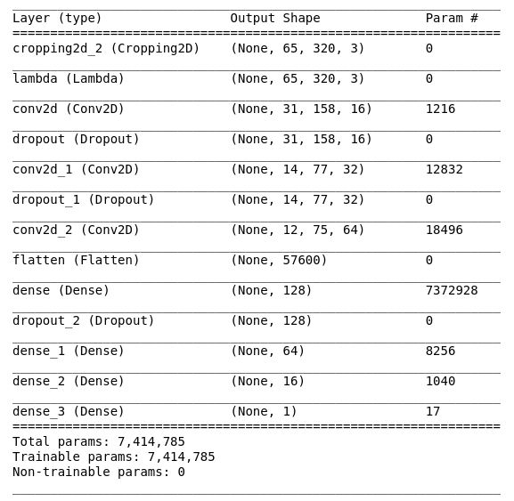
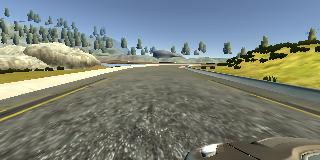
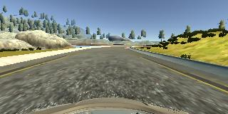
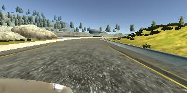

# Behavioral Cloning documentation

## General discussion

The project Goals
The file Structure
Data Preprocessing
Model architecture
Model Training
The results and how to run the code

## Goals

Goal is to train a neural network which decides the direction to drive. Thus
it's a regression on steering wheel angle.

## File structure

I used the given structure. I didn't adapt anything.

## Data Preprocessing

The data preprocessing involves the following steps on three versions of each
driving situation:

- angle correction: As the viewpoint of the cameras is different, we correction
the angle of the outer images by 0.2.
- flipping: Additionally an augmented version is used where the image is vertically
flipped. The angle is multiplied by -1.

The pictures are made from the left side, the center and the right side of
the car.

### Model creation process

I began by setting up infrastructure. That means, setting a maximally MLP with
three linear layers, a generator which makes use of center, left and right
camera images. Afterwards I dealt with color conversion, i.e. BGR/RGB.
Next I built a model using cropping, convolutional layers, dropout layers which
help dealing with image information and linear layers which deal with decision
making. The respective inductive bias, i.e. local vs global bias,
constitutes the theoretic idea.

## Model training

The model is trained with the standard Adam optimizer with a learning rate of
0.001 and MSE loss for 5 epochs.

### Results and how to run

The model is trained with the steps seen in the train_model.ipynb notebook.
- Training loss: 0.0188
- Validation loss: 0.0211
The README by Udacity describes how to interact with the simulator.

## Model description

The following picture shows the general architecture.

First we normalize and crop, according to the recommendations given in the
task description.
As we're working on images, we chose convolutions as a fundamental building block.
We're using a stride of (2, 2) and kernel sizes of 19, 32 and 64 to maximize
information.
In the end we use three linear layers to aggregate the information and perform
the regression using MSE loss.
We use 4 Dropout layers with a dropout factor of 0.3 to fight overfitting.

### Training Data

We used the supplied training data mixed with additional data augmentation.
No extra training data was created.
In general, each example consists of three images taken from the center, the left
and the right side of the car. We correct the angle by 0.2 for each side in order
to achieve some randomization. which will support dealing with overfitting.
Here are examples of such images:

